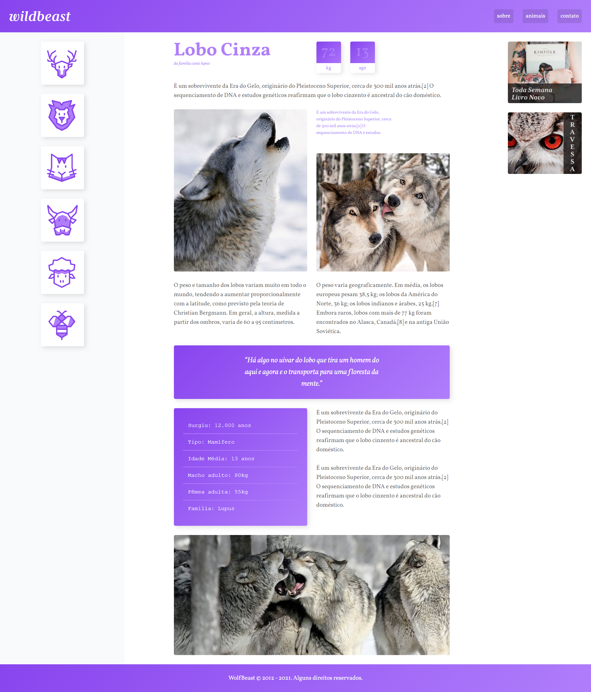
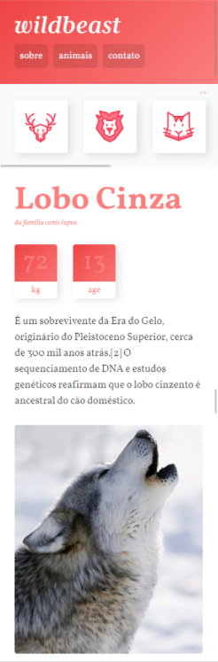

# WildBeast

## 📝 Sobre

**WildBeast** é um site criado para testar as propriedades do CSS Grid Layout, todo o site é responsivo.
  
O site **WildBeast** é um projeto de website criado no curso CSS Grid Layout da Origamid.

---------
---------

## 🖥️ Demonstração
  

## >>**[Clique aqui para acessar a demonstração do website](https://rodrigofonsecag.github.io/WildBeast/)**<<

----------
----------

## 🚀 Tecnologias e ferramentas utilizadas

- **HTML5**
- **CSS3**
- **HSL para mudar todas as cores do site mudando apenas uma variavel**

----
----

## 📝 Licença

O projeto está sob a licença MIT. Para saber mais, acesse o arquivo [LICENSE](https://github.com/RodrigoFonsecaG/bikcraft/blob/main/LICENSE).

---

**Desenvolvido por [Rodrigo Fonseca](https://github.com/RodrigoFonsecaG/).**
